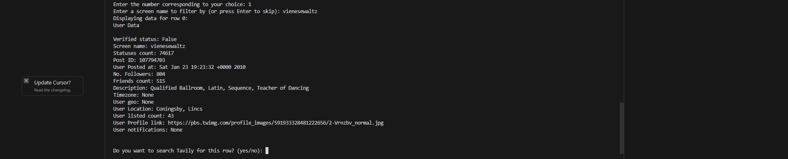
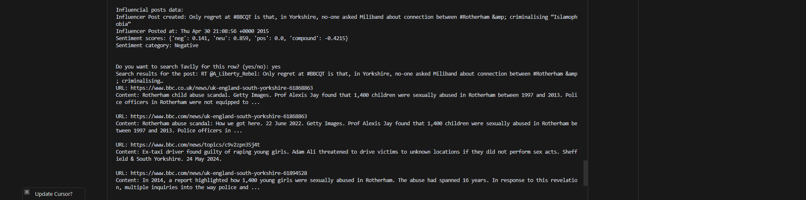

## Sentiment Fact Checker Project

I did this a summer project to check the sentiment of twitter dataset provided by NLTK. The commandline fact checker, and sentiment analyzer is easy to use. 
The approach used is through rule-based sentiment analysis. Specificly, VaderSentiment tool from NLTK is used to check the sentiment of the tweets. 
I have used API from Tavily, and also in future iterations, I intend to utilize OpenAI API. 
Tavily has an available python wrapper. So, aa an advanced search engine built in for AI agents (LLMs), the project utilizes it to check the factual correctness of the tweets. 
Lessons learned. There are many tools available that do a better job, so this is not a perfect project, but it was a good exercise to understand on a high level the working of LLMs and how to use APIs, and
also the working of NLP tools.

For more details please read further:
[Tavily](https://tavily.com/)
[VaderSentiment](https://pypi.org/project/vaderSentiment/)
[NLTK](https://www.nltk.org/nltk_data/)
[OpenAI](https://platform.openai.com/) *(in future iterations)*

Screenshots of the project are provided in the screenshots folder.
## Screenshots

Here are some screenshots of the project in action:

1. **Sentiment Analysis Output**
   

2. **User Data Display**
   

3. **Influencer Data Display**
   

4. **Fact Checking with Tavily**
   

5. **Charts and Graphs**
   